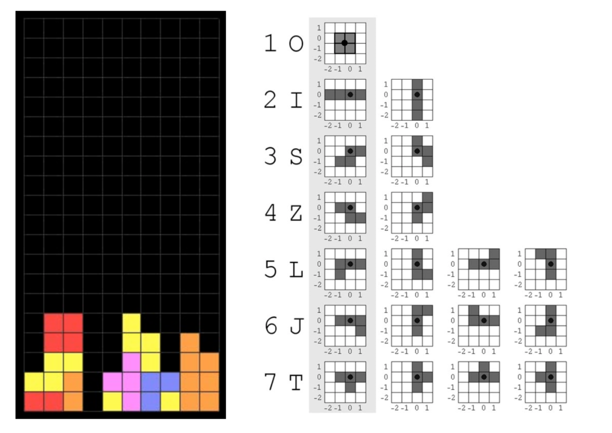

   This is a C++ implementation of Tetris game. To build this project, please make sure your system has OpenGL and g++ compiler installed.

    The game window consists of a 20 × 10 square grid of appropriate size, e.g., so that the window will fit in the screen comfortably. There are seven standard Tetris pieces (or tiles), as shown below, with pivot of rotation indicated by a black dot. You are advised to complete this problem in several steps.

    To compile this project, go to Tetris folder, and in your terminal type `make`. To run the program type `./Tetris`.
